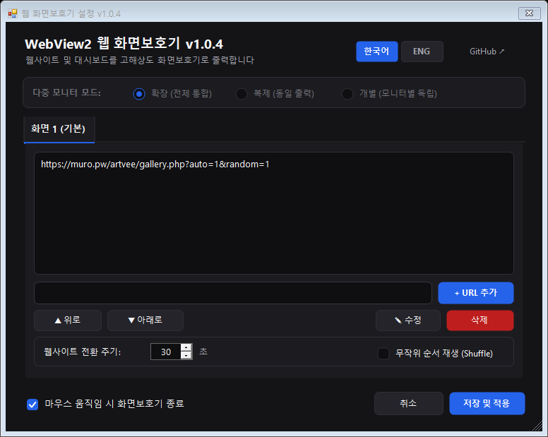
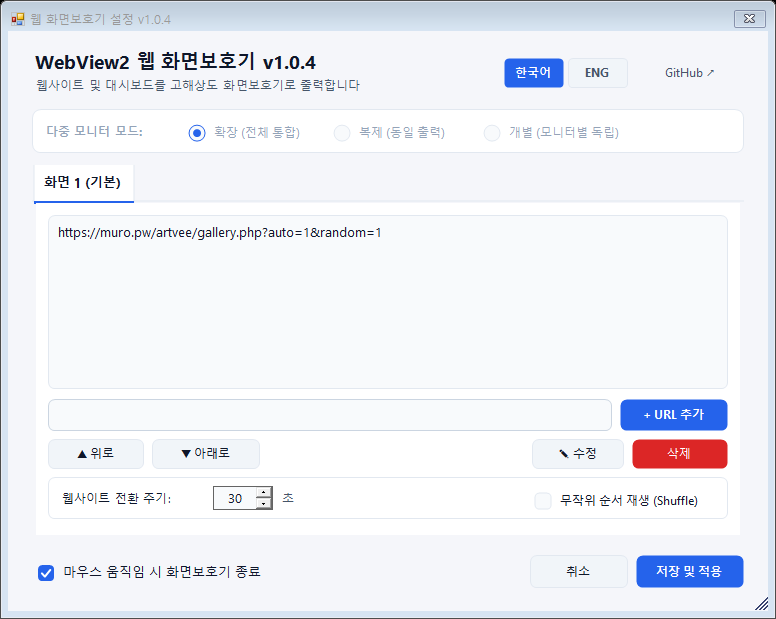

# WebView2 Web Page Screensaver

A Fork of the old archived project [ZenProjects/Chromium-Web-Page-Screensaver](https://github.com/ZenProjects/Chromium-Web-Page-Screensaver) that uses **Microsoft Edge WebView2 (Chromium)** in place of the [CefSharp WinForms](https://github.com/cefsharp/CefSharp) to display web pages as your screensaver.

## Features

- **Modern WebView2 Engine**: Chromium-based rendering with low resource usage.
- **Audio Mute**: Automatic sound muting during screensaver playback.
- **InPrivate Browsing**: Privacy mode leaving no browsing history, cache, or cookies.
- **Clock HUD Overlay**: Floating digital clock with 4 selectable screen corners.
- **Offline Digital Clock**: Graceful fallback neon clock when disconnected or page errors.
- **Live Web Preview**: Test URLs and display settings directly in the settings window.
- **Display Zoom Scaling**: Custom zoom levels (75%~200%) for 4K and QHD monitors.
- **Config Backup & Restore**: Single-click JSON export and import for easy migration.
- **Auto Update Notification**: Non-intrusive badge when newer GitHub releases are published.
- **Multi-Monitor Modes**: Span (Composite), Mirror (Clone), and Separate (Per-monitor URLs).
- **Custom Per-URL Duration**: Individual display times via `URL|seconds` format.
- **System Theme Sync**: Real-time Light and Dark mode switching with Windows theme.
- **Multi-language Support**: Instant toggle between English and Korean.

## Dependencies

- [.NET Framework v4.8+](https://dotnet.microsoft.com/ko-kr/download/dotnet-framework/net48)
- [Microsoft Edge WebView2 Runtime](https://developer.microsoft.com/en-us/microsoft-edge/webview2/)
- Windows 10 & up

## Download and Install

- Download the ***[Latest WebView2 Web Screensaver binary](https://github.com/muro-dot/Webview2_WebPage_Screensaver/releases/latest)***  
- Unzip it to a permanent directory
- Find `Webview2_WebPage_Screensaver.scr` in the unziped directory, right click it
- Select `Install` to install, or `Test` to test it out without installing it
- If installing it, the windows `Screen Saver Settings` dialog will pop up with the correct screen saver already selected
- Use the `Settings...` button in the same dialog to change the web page(s) list displayed by the screen saver

## Build 

- Clone the source repository
- Open the `.sln` project file with Visual Studio (Tested with VS 2026).
- Restore NuGet packages to download the `Microsoft.Web.WebView2` dependency.
- Build in `Release` with `Any CPU` or `x64` mode
- Find `Webview2_WebPage_Screensaver.scr` in `bin/Release`
- Right click the `.scr` file, select `Install` to install, or `Test` to test it out
- Use the `Settings...` button to configure your custom URLs.

### Preview (Dark Mode / Light Mode)

| Dark Mode | Light Mode |
| :---: | :---: |
|  |  |

# WebView2 웹 페이지 화면 보호기 (Web Page Screensaver)

이 프로젝트는 오래된 [ZenProjects/Chromium-Web-Page-Screensaver](https://github.com/ZenProjects/Chromium-Web-Page-Screensaver) 프로젝트를 포크하여 개선한 버전입니다. 기존의 [CefSharp WinForms](https://github.com/cefsharp/CefSharp) 대신 **Microsoft Edge WebView2 (Chromium)** 엔진을 사용하여 웹 페이지를 화면 보호기로 부드럽고 선명하게 출력합니다.

## 주요 기능

- **최신 WebView2 엔진**: 크로미움 기반의 고성능 및 저메모리 웹 렌더링.
- **오디오 자동 음소거**: 화면보호기 실행 시 웹페이지 미디어 소리 차단.
- **시크릿 모드 (InPrivate)**: 방문 기록, 캐시, 쿠키를 남기지 않는 안전 모드.
- **시계 HUD 오버레이**: 4개 모서리 위치 선택이 가능한 반투명 시계 위젯.
- **오프라인 시계 폴백**: 네트워크 단절 또는 오류 시 네온 디지털 시계 전환.
- **실시간 웹 미리보기**: 설정창에서 URL과 화면 상태 즉시 확인.
- **화면 배율 조절**: 4K 및 QHD 고해상도 환경 맞춤 줌(75%~200%) 지원.
- **설정 원클릭 백업/복원**: JSON 파일 기반의 설정 내보내기 및 가져오기.
- **업데이트 자동 감지**: 최신 릴리스 출시 시 상단 알림 뱃지 표시.
- **다중 모니터 지원**: 전체 통합(Span), 복제(Mirror), 모니터별 개별 설정(Separate).
- **URL별 개별 시간 설정**: `URL|초` 형식으로 사이트별 가변 표시 시간 지원.
- **Windows 테마 연동**: 시스템 라이트/다크 모드 실시간 자동 전환.
- **다국어 지원**: 한국어 및 영어 실시간 인터페이스 전환.

## 요구 사항

- [.NET Framework v4.8+](https://dotnet.microsoft.com/ko-kr/download/dotnet-framework/net48)
- [Microsoft Edge WebView2 런타임](https://developer.microsoft.com/en-us/microsoft-edge/webview2/ "WebView2 Runtime")
- Windows 10 이상 (권장)

## 다운로드 및 설치 방법

- ***[최신 WebView2 화면 보호기 실행 파일 다운로드](https://github.com/muro-dot/Webview2_WebPage_Screensaver/releases/latest)***  
- 다운로드한 압축 파일을 원하는 폴더(예: `C:\Program Files\WebScreensaver`)에 풉니다.
- 폴더 내의 `Webview2_WebPage_Screensaver.scr` 파일을 마우스 우클릭합니다.
- **'설치'**를 선택하여 시스템에 등록하거나, **'테스트'**를 눌러 즉시 실행해 볼 수 있습니다.
- 설치 후 나타나는 '화면 보호기 설정' 창에서 **'설정...'** 버튼을 눌러 출력할 웹 페이지 주소를 변경할 수 있습니다.

## 빌드 방법 (개발자용)

- 소스 코드를 클론(Clone)합니다.
- Visual Studio로 `.sln` 솔루션 파일을 엽니다 (VS 2026 권장).
- **NuGet 패키지 복원**을 통해 `Microsoft.Web.WebView2` 의존성을 다운로드합니다.
- 빌드 구성을 `Release`, 플랫폼을 `Any CPU` 또는 `x64`로 설정하여 빌드합니다.
- `bin/Release` 폴더에 생성된 `Webview2_WebPage_Screensaver.scr` 파일을 우클릭하여 설치 및 사용합니다.

### 테마 미리보기 (Dark Mode / Light Mode)

| 다크 모드 (Dark Mode) | 라이트 모드 (Light Mode) |
| :---: | :---: |
|  |  |

